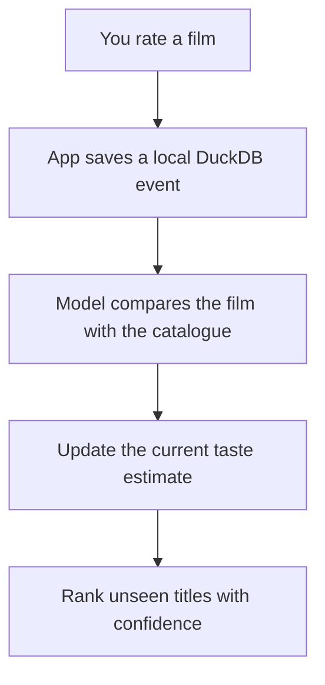
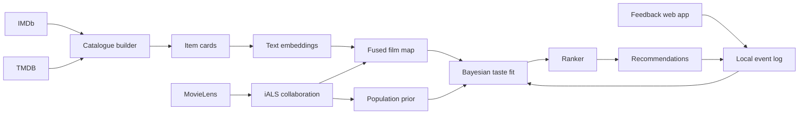
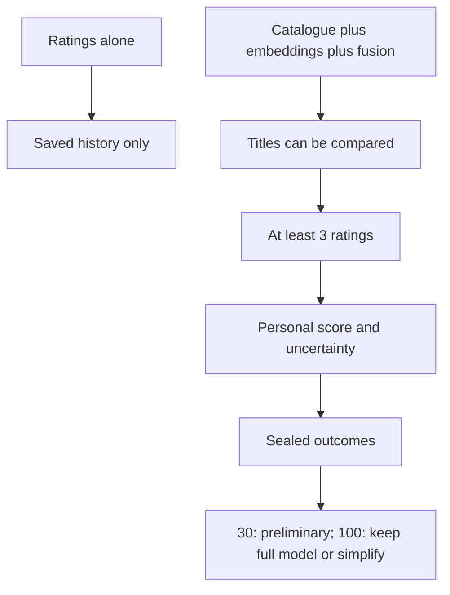
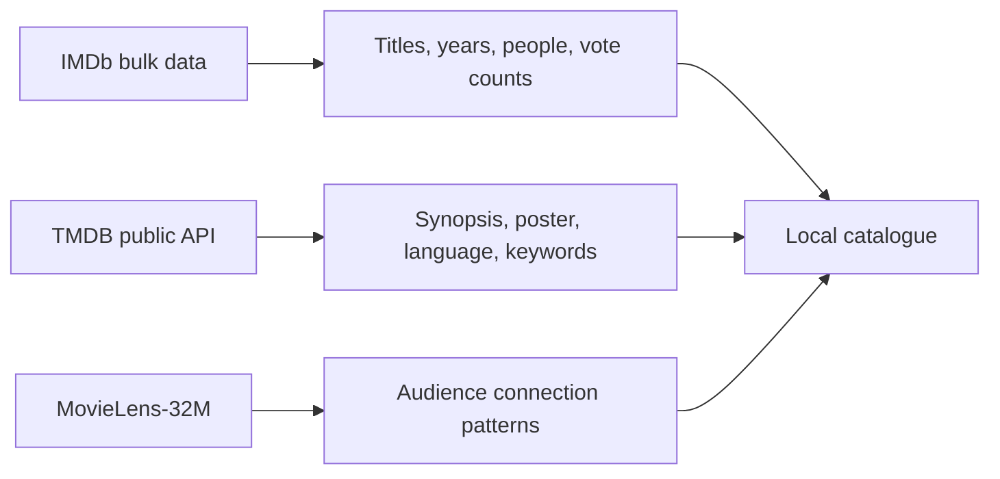
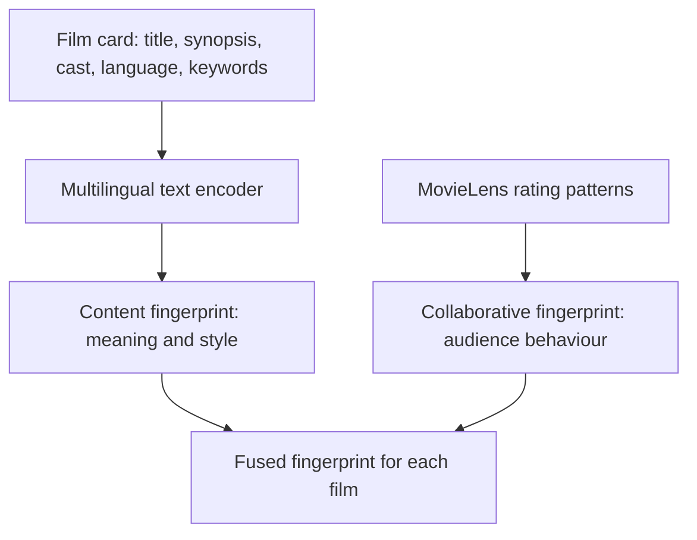
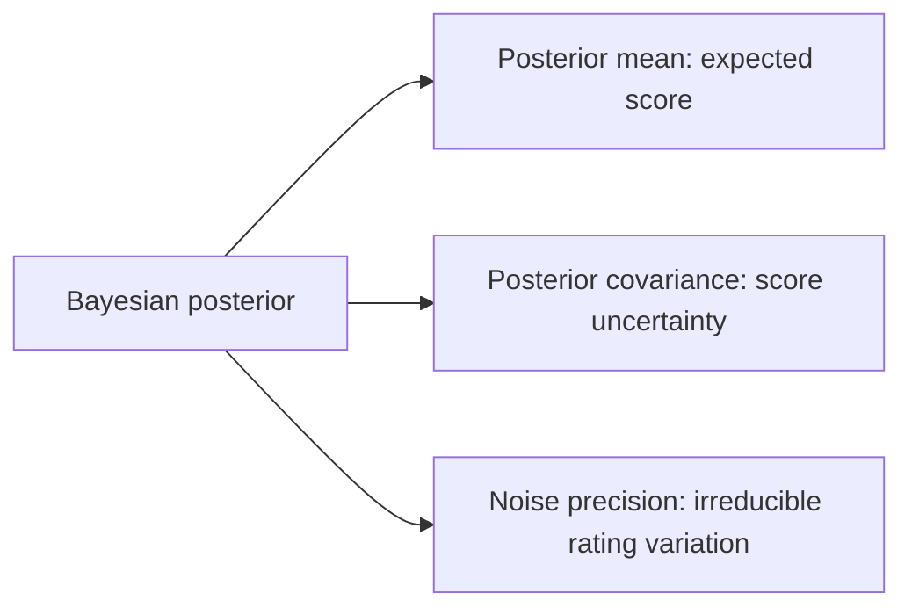
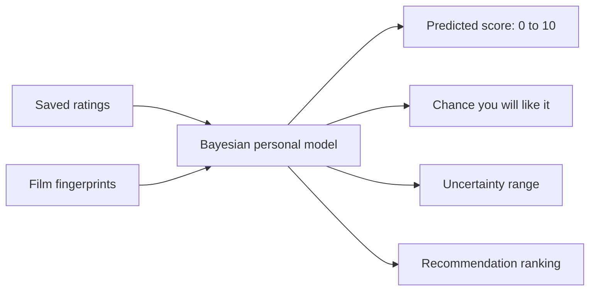
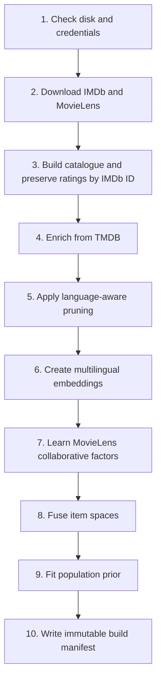
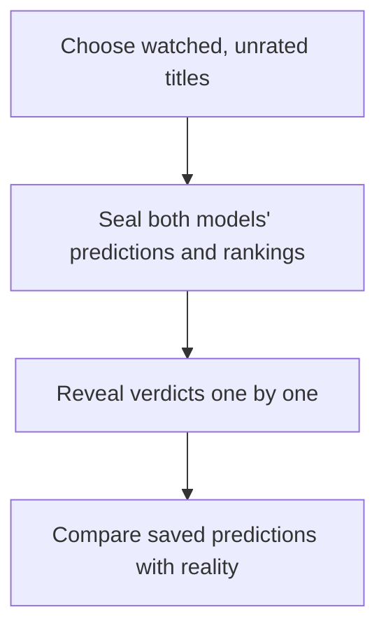

# How Entertainer learns your taste

This is a local movie and TV recommender. Think of it as a small private
research assistant: you show it films you have watched, it looks for patterns,
and it makes its best next suggestions while being honest about uncertainty.

## The short version

The saved rating history is the source of truth. The model can always be
rebuilt from it, so it cannot quietly forget a rating or learn from a hidden
copy of your data.

## System map: the parts and their hand-offs

There are two connected systems: a **slow catalogue factory** that builds the
shared film map, and a **fast personal loop** that learns from your ratings.
The factory runs occasionally; the personal loop runs whenever you rate or ask
for recommendations.

| Component | Why it is needed | How it is implemented | It hands off to |
| --- | --- | --- | --- |
| Feedback web app | Lets you give quick, low-friction verdicts and see what was saved | FastAPI backend with a small local HTML/JS interface | Local event log |
| Event log | Preserves the complete history; a rating is never only an in-memory click | DuckDB `events` table; latest explicit verdict per title is used when fitting | Personal model and exports |
| Catalogue builder | Gives every film a stable identity and usable metadata | Polars reads IMDb TSV files; DuckDB stores the resulting title table | Item cards and search/feed |
| TMDB enrichment | Supplies detail IMDb lacks, especially synopsis and original language | Async HTTP client, batched and resumable; results stored beside each title | Language pruning and item cards |
| Item cards / embeddings | Turns human-readable film information into comparable numbers | A multilingual Qwen encoder converts one compact text card per title into vectors | Fused film map |
| Collaborative filtering | Captures audience relationships that summaries do not say explicitly | iALS factorises the MovieLens user–title matrix; held-out users are excluded | Fused film map and population prior |
| Fused film map | Provides one common coordinate system for every title | Content and collaborative vectors are combined, confidence-aware, then reduced with PCA | Personal model, similar-title search, ranker |
| Bayesian taste fit | Learns what *you* tend to like while measuring uncertainty | Closed-form Bayesian ridge regression, optionally with an evidence-selected non-linear lift | Ranker, score/confidence display |
| Ranker | Produces a useful top-ten rather than ten clones | Filters candidates, scores them, adds measured exploration, diversifies with MMR, logs propensities | Recommendation slate |
| Sealed validation | Checks personal performance without changing a prediction after the fact | Saves both full-model and ridge predictions before your verdict is revealed | Immutable evidence reports |
| Manifests and reports | Make results auditable and comparable over time | JSON records with hashes, settings, seeds, split IDs, and timestamps | Dashboard/export |

### What depends on what

The feedback app can run in a lightweight live mode with only TMDB access. It
can save ratings, show rated titles, and avoid showing them again. But it
cannot make full personalized recommendations until the catalogue factory has
created the embeddings and fused film map.

This separation is intentional. Your personal data remains small and local,
while the expensive public-data work can be rebuilt, moved as a bundle, or
replaced without rewriting what you watched and how you rated it.

## A story: you rate a film

Imagine you rate *Kumbalangi Nights* as **love**.

1. The feedback page saves that verdict, time, and title identifier in your
   local `data/entertainer.duckdb` file.
2. That title already has a compact numeric "fingerprint." It represents
   clues from its synopsis, cast, language, themes, and how MovieLens viewers
   connected it with other titles.
3. The model moves its internal taste pointer slightly towards fingerprints
   similar to that film. A **dislike** moves it in the other direction.
4. It compares the taste pointer with every unseen title fingerprint. Titles
   nearest the pointer get higher predicted scores.
5. It also calculates uncertainty. A confident recommendation is safer; an
   uncertain one may be included because your answer would teach the model.

This is not a rule that says “you like Malayalam films, show Malayalam films.”
Language, format, year, and runtime can be hard filters when you request them.
Otherwise the model learns from the film as a whole.

## Where the catalogue comes from

| Source | What it adds | Why it is used |
| --- | --- | --- |
| IMDb | International title coverage, credits, years, and vote counts | A dependable catalogue backbone, including smaller film industries. |
| TMDB | Summaries, posters, keywords, and original language | A synopsis contains tone and story details that titles and genres miss. |
| MovieLens-32M | Anonymous public ratings | It reveals relationships between films that text alone cannot describe. |
| Your ratings | What *you* liked, disliked, or skipped | This is the only data used to personalize recommendations. |

The build uses TMDB's original-language field before applying language-aware
quality thresholds. A good Malayalam film naturally receives far fewer global
votes than a major English release; one global vote threshold would unfairly
discard it.

## How a film becomes numbers

Computers cannot compare a plot summary directly. They need a list of numbers
called an **embedding**. A helpful mental model is a map: films with similar
meaning appear near each other.

The project uses a multilingual Qwen embedding model because the catalogue is
not English-only. MovieLens ratings are factorised with **implicit alternating
least squares (iALS)**, a standard technique that finds hidden patterns such
as “people who enjoyed these films often also enjoy those films.”

The fingerprints are fused together. If MovieLens has never seen a title, the
system estimates its collaborative part from content and marks that estimate
as less certain. A new or regional title is never treated as if it had the
same evidence as a widely rated title.

## How the personal model works

The final personal model is deliberately small. One person may provide
50–200 ratings, far too little data for a giant neural network to learn
responsibly.

It uses **Bayesian ridge regression**. In everyday language:

- It finds directions on the film map that separate titles you liked from
  titles you did not.
- It avoids overreacting to a handful of ratings. This restraint is “ridge.”
- It produces both a prediction and an uncertainty range. Uncertainty is a
  feature, not a failure.

### Technical view: what is fitted

For each rated title, the model receives its fused feature vector `x` and a
numeric reward `y` (the verdict mapped onto a 0–1 scale). It learns weights
`w` in the equation `y ≈ xw + noise`. Ridge regularisation keeps `w` small
unless the ratings contain clear evidence for a direction. The Bayesian form
keeps a distribution over `w`, rather than only one best vector:

The current feature pipeline uses a 256-dimensional multilingual content
embedding, 192 iALS collaborative factors (reduced to the 48 most recoverable
components before fusion), and PCA to form a 192-dimensional fused item space.
The personal fit also adds an intercept and a few simple metadata features.
It adds 1,000 *weak*, deterministic sampled negatives from unseen catalogue
titles: this gives the model contrast without pretending those titles are
explicit dislikes. Explicit ratings have much more weight; skips have less.

Older ratings are gently down-weighted with a 1,100-day half-life, so a major
change in taste can eventually show up without erasing your history.

The production model may add a carefully checked non-linear lift using random
Fourier features and a population prior derived from MovieLens. It is compared
with a plain ridge model on exactly the same personal validation cases. If the
complex model cannot prove it is better after 100 completed blind cases, the
application should simplify back to ridge.

“Like” means a `love` or `like` verdict. Score prediction is kept separately
because it preserves more detail than a simple yes/no answer.

## Why some recommendations are surprising

Most recommendations use the best estimated score. A few can be chosen by
**Thompson sampling**, which means selecting one plausible version of your
taste rather than always choosing the safest average guess. This lets the app
discover a new corner of your taste without filling the whole slate with
experiments. Exploratory suggestions are labelled as such.

### Technical view: making a slate

The recommender does not simply sort every title by score. It first removes
titles you have rated or dismissed, then applies hard filters such as language,
film/series, year, and runtime. It scores the remaining candidates, retains a
shortlist, calculates uncertainty only where it can affect the outcome, and
uses maximal marginal relevance (MMR) to avoid ten near-duplicates. A soft
per-language cap prevents a multilingual catalogue collapsing into one
language. Each displayed item logs its score, uncertainty, policy, and
propensity (its chance of being shown), which is needed for later analysis.

## The complete build pipeline

`ent setup` runs these stages locally. It is resumable: completed downloads
and artifacts are reused rather than restarted.

The first full build is intentionally slow because it processes a large public
catalogue. Rating and prediction are fast after artifacts exist: the personal
model refits from your small local history in milliseconds.

### What makes a build reproducible

Each build and evaluation writes an immutable manifest. It records source and
artifact hashes, catalogue composition, model settings, frozen MovieLens test
users, random seeds, split identifiers, and timestamps. A later report can
therefore say which exact inputs generated a result instead of relying on a
memory of what ran.

## How we check whether it is helping

The project has two different checks.

### Offline check: MovieLens replay

Some MovieLens users are held completely out of collaborative training, then
treated as new users. Competing methods receive the same known ratings and
their ranking quality is compared. This checks the engineering method, but it
cannot prove the model understands *your* taste.

### Personal check: sealed hidden-pool validation

You add films you have already watched but have not rated. Before any verdict
is revealed, the app seals predictions and rankings from both the full model
and ridge baseline. Only then do you reveal what you thought.

Sealed predictions cannot change after seeing the answer. “Not seen” remains
unresolved and never improves either model’s score. The primary result is
**Top-10 hit rate**: among titles ranked in a model’s top ten, how often did
you actually like them? Reports also include score error, calibration, and
95% confidence intervals. Thirty cases are preliminary; at 100, the full
model stays only if it proves a positive Top-10 lift over ridge.

Real recommendation slates are logged separately. They show whether you
actually watch and like suggested titles, but are observational rather than a
randomized experiment.

### The metrics, without hiding the trade-offs

| Metric | What it answers | Why it matters |
| --- | --- | --- |
| Top-10 hit rate | Did the model's highest-ranked titles turn out to be liked? | This is the main product question. |
| NDCG@10 / precision@10 | Did it put good titles near the top? | Ranking order matters more than an average score. |
| MAE / RMSE | How far were numeric score predictions from your verdicts? | Useful, but secondary to the top of a slate. |
| Brier score / calibration | When it says “likely to like,” is that probability trustworthy? | Prevents confident-looking but unreliable scores. |
| 95% confidence interval | How uncertain is the measured result? | Stops a few lucky outcomes being treated as proof. |

## What is stored, and where

| Item | Location | Purpose |
| --- | --- | --- |
| Your rating events | Local DuckDB database | The source of truth for your taste. |
| Catalogue and model artifacts | Local `data/` directory | Makes recommendations fast after the build. |
| Build/evaluation manifests | Local `data/reports/manifests/` | Records the exact data and settings used. |
| TMDB credential | Local `.env` file | Fetches public metadata; it is not committed. |

Your ratings are not sent to IMDb, TMDB, MovieLens, or a central application
server. They are deliberately ignored by Git because a rating history is
personal data. To move it to another computer, use `ent export` and transfer
the resulting file privately; on the other machine use `ent import` after the
catalogue is ready.

## A useful expectation

More ratings help, especially a mix of love, like, fine, and dislike. Treat
early recommendations as informed experiments, not proof. The sealed
validation process is how the app moves from “an interesting guess” to
evidence about whether it is genuinely useful for you.
